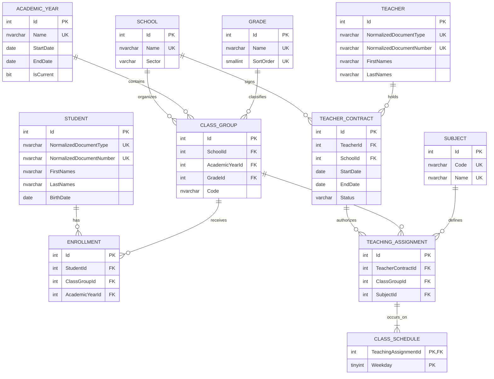

# Modelo entidad-relación

## Vista general

La fuente detallada de campos y tipos es [data-model.md](../specs/001-school-enrollment-management/data-model.md). Este documento presenta cardinalidades, integridad, normalización y cómo el modelo responde las preguntas municipales.

## Entidades y cardinalidades

El diagrama representa el dominio completo. La entrega P0 materializa primero School, AcademicYear, Grade, ClassGroup, Student, Enrollment, Teacher y TeacherContract; P1 condicional agrega Subject, TeachingAssignment y ClassSchedule. No se incorpora una tabla de oferta académica: la inexistencia de ClassGroup para referencias de catálogo existentes significa contexto válido sin grupos.

| Entidad | Propósito | Cardinalidad histórica |
| --- | --- | --- |
| `School` | catálogo de escuelas con sector cerrado | una escuela tiene grupos y contratos |
| `AcademicYear` | catálogo con límites y año actual | un año contiene muchos grupos; nunca es entero libre |
| `Grade` | nivel ordenado | un grado participa en grupos de varios años/escuelas |
| `ClassGroup` | contexto school+year+grade+code | recibe inscripciones y asignaciones |
| `Student` | identidad documental canónica | tiene cero o muchas inscripciones, máximo una por año |
| `Enrollment` | hecho anual histórico | pertenece a un estudiante y un grupo |
| `Teacher` | identidad docente precargada | tiene cero o muchos contratos |
| `TeacherContract` | relación temporal docente-escuela | autoriza cero o muchas asignaciones |
| `Subject` | catálogo de materias | participa en muchas asignaciones |
| `TeachingAssignment` | contrato que sirve materia a grupo | tiene uno o más weekdays |
| `ClassSchedule` | weekday atómico, sin horas | pertenece exactamente a una asignación |

## Integridad SQL

| Área | Restricciones principales |
| --- | --- |
| Identidad | UNIQUE normalized document type+number en `Student` y `Teacher` |
| Contexto académico | UNIQUE school+year+grade+code; AK group id+year; FK compuesto Enrollment(group,year) |
| Inscripción | UNIQUE student+year; no duplica school ni grade |
| Año | CHECK end>=start; UNIQUE filtrado de `IsCurrent=1` |
| Escuela | CHECK `Sector IN ('Public','Private')` |
| Contrato | CHECK end null/end>=start; CHECK status; índice UNIQUE sin filtro sobre teacher+school+start+end |
| Asignación | UNIQUE contract+group+subject; FK a cada padre |
| Horario | PK assignment+weekday; CHECK 1..7 |

Índices de consulta: grupos por year/grade/school; estudiantes por apellido/nombre; enrollments por group; contratos por teacher/school/dates y school/status/dates; assignments por group/subject. Las claves FK no cubiertas reciben índice. Todos los deletes son `NO ACTION`: School, Student, año, grupo, contrato, asignación o materia no pueden eliminar historia referenciada.

## Reglas que requieren aplicación

- Comparar identidad normalizada y datos personales equivalentes.
- Rechazar fecha de nacimiento futura.
- Validar school/grade/year solicitados contra el `ClassGroup`; el FK compuesto cubre year, mientras school y grade se comparan al cargar el grupo.
- Detectar cualquier superposición inclusiva para teacher+school dentro de transacción `Serializable`. SQL `CHECK` no compara filas; no se usa trigger por opacidad y costo.
- Validar que `TeacherContract.SchoolId` coincida con `ClassGroup.SchoolId` y que contrato/año se intersecten al menos un día.
- Exigir uno o más weekdays antes de confirmar una asignación; SQL valida cada weekday pero no existencia de hijos sin trigger.

## Normalización

Todas las tablas cumplen 3NF. Catálogos, identidades, contratos, asignaciones y horarios alcanzan BCNF con las claves declaradas. `Enrollment` llega a 3NF pero no BCNF por `ClassGroupId → AcademicYearId`: year es atributo primo de `(StudentId, AcademicYearId)`. La redundancia permite UNIQUE anual y el FK compuesto impide divergencia. Es preferible a duplicar school/grade o confiar solo en una validación concurrente de aplicación.

No hay agregados almacenados. Sector se representa como string enum+CHECK, no lookup, por ser un conjunto cerrado sin metadata o mantenimiento. El estado contractual persistido `Confirmed|Cancelled` no sustituye la vigencia calculada.

## Respuesta a las preguntas de negocio

1. **BQ-001**: filtrar `Enrollment` por año/contexto, calcular edad de `Student.BirthDate` a `asOfDate` y contar 3..7.
2. **BQ-002**: la misma población agrupa 3..7, 8..12 y >12; menores de 3 se excluyen.
3. **BQ-003**: unir contratos `Confirmed` temporalmente pertinentes con School y contar `DISTINCT TeacherId` por `Sector`; un docente puede contar una vez en cada sector.
4. **BQ-004**: unir Enrollment→ClassGroup→School, agrupar por escuela/año, obtener máximo y devolver todas las escuelas cuyo conteo lo iguale.
5. **BQ-005**: localizar Student por documento normalizado, recorrer Enrollment→ClassGroup→TeachingAssignment→TeacherContract/Teacher/Subject y preservar años y multiplicidad.

Las cinco respuestas se derivan de hechos históricos; ninguna depende de contadores, “escuela actual” o “contrato actual” persistidos.
