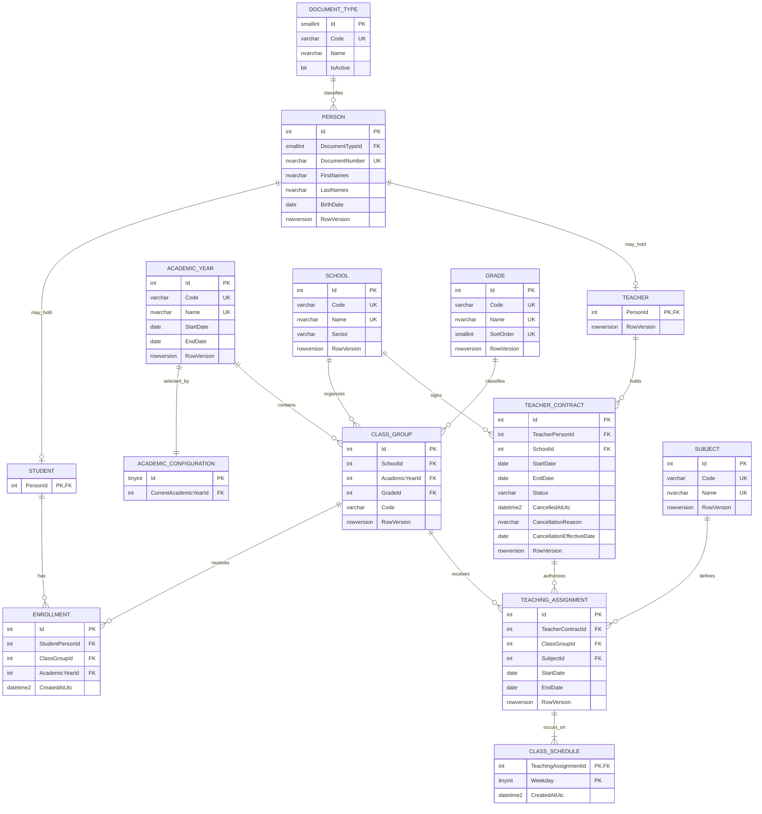

# Modelo entidad-relación de producción

## Vista canónica

La definición completa de columnas, constraints e índices está en [data-model.md](../specs/001-school-enrollment-management/data-model.md). `AcademicYear` pertenece a `catalog`; no existe `academic.AcademicYear`.

`School`, `AcademicYear`, `Grade`, `ClassGroup`, `Person`, `Teacher`, `TeacherContract`, `Subject` y `TeachingAssignment` incluyen además `CreatedAtUtc` y `UpdatedAtUtc`; el diagrama omite esos campos repetidos para reducir carga visual. `Enrollment` y `ClassSchedule` solo incluyen `CreatedAtUtc`; `DocumentType`, `Student` y `AcademicConfiguration` no reciben auditoría genérica ni rowversion.

## Cardinalidades e historia

| Relación | Garantía |
| --- | --- |
| `Person`–`Student` / `Person`–`Teacher` | PK=FK uno-a-uno independiente; una persona puede tener ambos roles |
| `Student`–`Enrollment` | cero o muchas inscripciones; máximo una por `AcademicYear` |
| `ClassGroup`–`Enrollment` | FK compuesto grupo+año evita divergencia |
| `Teacher`–`TeacherContract`–`School` | contratos históricos independientes por escuela |
| `TeachingAssignment` | contrato, grupo, materia y período propio; compatibilidad escolar/temporal transaccional |
| `ClassSchedule` | uno o más weekdays atómicos por asignación |

P0 materializa 11 tablas: todas excepto `Subject`, `TeachingAssignment` y `ClassSchedule`. P1 agrega esas tres sin reestructurar P0.

## Integridad SQL

| Área | Defensa principal |
| --- | --- |
| Identidad | `UQ_Person_DocumentTypeId_DocumentNumber` con `Latin1_General_100_CI_AS`; no hay columnas duplicadas de comparación |
| Año actual/referencias | singleton `AcademicConfiguration(Id=1)`, seed, permisos restringidos y `TR_AcademicConfiguration_PreventDelete`; `DocumentType` con SELECT y DENY runtime de INSERT/UPDATE/DELETE |
| Contexto anual | `UQ_ClassGroup_Id_AcademicYear_ForEnrollment` + FK compuesto de `Enrollment` |
| Historia anual | `UQ_Enrollment_StudentPersonId_AcademicYearId`; sin `SchoolId`/`GradeId` duplicados |
| Códigos/sector | save behavior EF y triggers estrechos; un `CHECK` no pretende detectar cambios entre versiones |
| Auditoría | defaults UTC, interceptor de `UpdatedAtUtc`, checks cronológicos y `rowversion` |
| Cancelación | los tres datos requeridos en `Cancelled` y nulos en `Confirmed` |
| Períodos | checks locales; compatibilidad entre tablas en aplicación dentro de transacción |
| Borrado | todas las FK `NO ACTION`; no existe soft delete genérico |

## Accesos físicos

- Inscripciones: seek `ClassGroupId, StudentPersonId` con `AcademicYearId,CreatedAtUtc` incluidos; unicidad anual por estudiante+año.
- Contratos: índices separados por `TeacherPersonId, StartDate, EndDate` y `SchoolId, StartDate, EndDate`, cubriendo listas y reporte de sector sin un tercer índice filtrado redundante.
- Asignaciones: índices cubrientes por `ClassGroupId`/período y `TeacherContractId`/período, con `SubjectId` incluido.
- FK no lideradas por estos índices reciben soporte mínimo; PK/UNIQUE ya existentes no se duplican.

Los índices nonclustered no declaran `Id` en INCLUDE: la PK clustered predeterminada ya lo aporta. Si cambia el clustering de una PK, el diseño y `IT-INDEXES-P0/P1` deben re-evaluar la cobertura.

## Normalización

Todas las tablas cumplen 3NF. Los catálogos, configuración, persona, roles, grupo, contrato, asignación y horario alcanzan BCNF. `Enrollment` conserva `AcademicYearId` y queda en 3NF, no BCNF, por `ClassGroupId → AcademicYearId`; el atributo es primo en la clave candidata `(StudentPersonId, AcademicYearId)` y el FK compuesto impide divergencia. Esta dependencia es necesaria para unicidad anual concurrente sin trigger entre tablas.

No hay agregados de reportes ni segunda fuente de escuela/grado. Los reportes derivan desde hechos históricos y roles comparten una única identidad `Person`.
